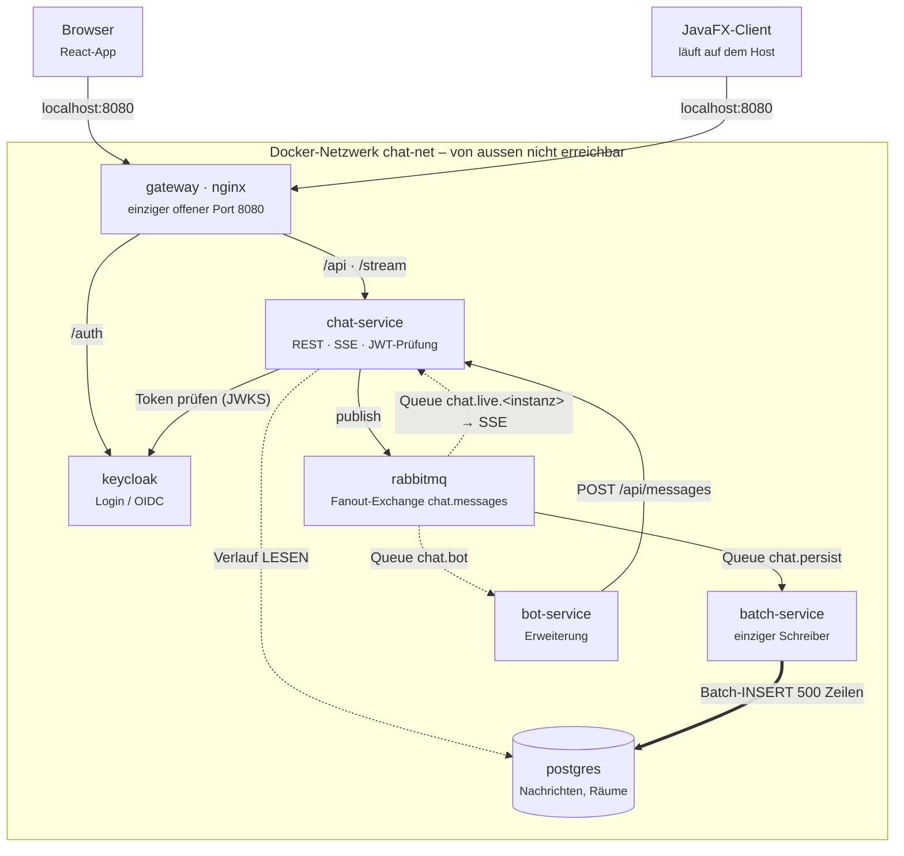
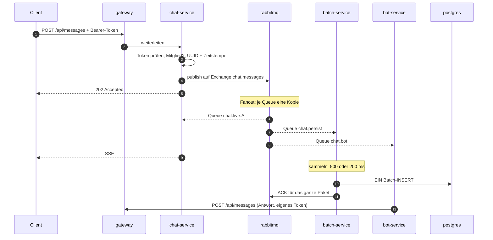

# PLANUNG.md – Chat-App (Java 21)

Modul M321 (Verteilte Systeme / Microservices), Klasse IT3b.

Grundlage: die Skizze aus dem Unterricht (Stack + Blockdiagramm), die Vorgaben (Keycloak, docker-compose,
internes Docker-Netzwerk, nur die Web-App über Localhost erreichbar) und der Abgleich mit dem
Referenz-Repository des Lehrers (`pritzit-mpritz/it3b-m321`). Diese Planung übernimmt das Gerüst der
Referenz, damit sie zum Code passt, der im Unterricht entsteht – und ergänzt es um eigene Teile
(Bot-Service, Offline-Zustellung). Was woher kommt, steht im Abschnitt *Verlauf*.

---

## 1. Stack

| Bereich | Entscheidung | Warum |
|---|---|---|
| Sprache | **Java 21** | Vorgabe aus der Skizze |
| Backend-Framework | **Spring Boot 3.5.16** | REST, SSE, AMQP, OAuth2-Resource-Server und JDBC ohne Fremdbibliotheken; Version wie im Bootstrap-Plan der Referenz |
| Datenzugriff | **`JdbcTemplate`**, kein JPA, kein Lombok | SQL steht im Klartext, jede Spalte sichtbar – Codestil aus `CLAUDE.md` |
| Web-UI | **React** (eigenes UI-Modul), Live-Nachrichten per **SSE** | Eigenständig deploybarer Service – passt zum Modulthema Microservices |
| Desktop-UI | **JavaFX-Client** (letzter Schritt) | Zweiter Client gegen dieselbe API, zeigt Client-Unabhängigkeit des Backends |
| Login | **Keycloak** (OIDC, Authorization Code + PKCE) | Vorgabe |
| Message Queue | **RabbitMQ**, Fanout-Exchange | Queues sichtbar in der Management-UI, Lehrplan-Vokabular, wenig Code |
| Datenbank | **PostgreSQL** | Standard, gut dokumentiert. Nachrichten schreibt **nur** der `batch-service`, gebündelt |
| Einstiegspunkt | **nginx** als Gateway / Reverse Proxy | Einziger nach aussen offener Port |
| Bot | **`bot-service`** (Spring Boot, eigener Consumer) – *Erweiterung* | Eigene Idee; hängt als dritte Queue am Fanout-Exchange, ohne dass ein anderer Service angefasst wird |
| Betrieb | **docker-compose**, ein internes Netzwerk `chat-net` | Vorgabe |

## 2. Architektur

### Grundprinzip: Netzwerk-Isolation

Alles unterhalb des Gateways läuft **ausschliesslich** im Docker-Netz `chat-net`. Keiner dieser Container
veröffentlicht einen Port auf den Host. Genau ein `ports:`-Eintrag ist erlaubt – der des Gateways (`8080`).
Die Services erreichen einander über ihren Service-Namen als Hostname (`chat-service`, `rabbitmq`, …);
das übernimmt Dockers interner DNS.

Merksatz: `expose` macht einen Port **nur im Docker-Netz** sichtbar, `ports` veröffentlicht ihn auf dem Host.

### Komponenten



### 2.1 Die Services und ihre Aufgaben

**gateway (nginx)** – einziger offener Port `8080`. Liefert das React-Bundle aus und leitet weiter:

| Pfad | Ziel im Docker-Netz |
|---|---|
| `/` | statisches React-Bundle |
| `/api/…` | `chat-service:8080` |
| `/stream` | `chat-service:8080` (SSE) |
| `/auth/…` | `keycloak:8080` |

**chat-service** – das «Backend» aus der Skizze:
- `POST /api/messages` – Nachricht entgegennehmen, UUID und Zeitstempel setzen und **nur** auf den
  Fanout-Exchange publizieren. Schreibt selbst **nicht** in die Nachrichtentabelle. Antwortet `202 Accepted`.
- `GET /api/messages?roomId=…` – Verlauf der letzten N Nachrichten aus der Datenbank **lesen**.
- `GET /stream` – SSE-Verbindung. Hört per `@RabbitListener` auf seiner Live-Queue und schiebt jede
  Nachricht in alle offenen SSE-Verbindungen.
- Raumverwaltung – `POST /api/rooms`, `POST /api/rooms/{id}/members`, `GET /api/rooms`. Diese drei
  schreiben direkt in die Datenbank (kleine Datenmengen, keine Bündelung nötig).
- Prüft bei jedem Aufruf das JWT von Keycloak (OAuth2 Resource Server).

**batch-service** – läuft ohne Web-Oberfläche und **genau einmal**. Er ist der **einzige Dienst, der in die
Nachrichtentabelle schreibt**: liest fortlaufend aus `chat.persist` und schreibt gebündelt (Abschnitt 2.3).
Zusätzlich zeitgesteuert: alte Nachrichten archivieren, nächtliche Statistik.

**bot-service** *(Erweiterung, nach dem Pflichtprogramm)* – eigener kleiner Spring-Boot-Dienst ohne
Web-Oberfläche. Hängt mit der Queue `chat.bot` am selben Fanout-Exchange, sieht also jede Nachricht.
Reagiert regelbasiert (z. B. auf `@bot …` oder bestimmte Stichwörter) und schickt die Antwort über
`POST /api/messages` an den `chat-service` – **denselben Weg wie ein menschlicher Nutzer**. Der Bot hat
dafür einen eigenen technischen Benutzer in Keycloak (Client Credentials). Damit läuft die Antwort
durch dieselbe Prüfung, dieselbe Queue und dieselbe Bündelung wie alles andere. Kein anderer Service
weiss, dass es den Bot gibt – das ist der Sinn des Fanout-Exchange.

**keycloak** – Login, gibt JWTs aus. Realm `chat`, wird beim Start aus einer Export-Datei importiert.

**rabbitmq** – Fanout-Exchange `chat.messages`, drei Arten von Queues (Abschnitt 2.4).

**postgres** – Tabellen `room`, `room_member`, `message` (Abschnitt 3).

### 2.2 Nachrichtenfluss (der wichtigste Ablauf im Modul)

1. Der Client sendet `POST /api/messages` mit Bearer-Token an das Gateway.
2. Das Gateway leitet an `chat-service` weiter.
3. `chat-service` prüft das Token, prüft die Mitgliedschaft im Raum, vergibt UUID und Zeitstempel und
   publiziert auf den Fanout-Exchange `chat.messages`. Danach antwortet es `202`.
   **Keine Datenbank im Anfrageweg.**
4. Am Exchange hängen drei Arten von Queues – jede bekommt eine Kopie:
   - `chat.live.<instanz>` – eine pro `chat-service`-Instanz, flüchtig. Für die Anzeige.
   - `chat.persist` – eine einzige, dauerhafte Queue. Für das Speichern.
   - `chat.bot` – eine Queue für den `bot-service`. Für automatische Antworten.
5. Jede `chat-service`-Instanz schiebt ihre Kopie sofort über SSE an ihre Clients.
6. Der `batch-service` sammelt seine Kopien und schreibt sie gebündelt in PostgreSQL.
7. Der `bot-service` prüft, ob er antworten soll – und wenn ja, geht seine Antwort bei Schritt 1 wieder rein.



### 2.3 Schreibpfad: warum gebündelt statt einzeln

Bei hoher Last (Denkvorgabe: 100 000 Nachrichten pro Sekunde) wären einzelne `INSERT`-Anweisungen der
Engpass – jede kostet einen Roundtrip, ein Parsen und einen Commit. Der `batch-service` sammelt deshalb:

| Regel | Wert | Warum |
|---|---|---|
| Paketgrösse | 500 Nachrichten | Ein `INSERT` mit 500 Zeilen statt 500 Anweisungen |
| Zeitlimit | 200 ms | Damit auch bei wenig Betrieb nichts liegen bleibt |
| Ausgelöst durch | was zuerst eintritt | Voll oder Zeit abgelaufen |

Umsetzung: Spring AMQP mit `setConsumerBatchEnabled(true)`, `setBatchSize(500)`, `setReceiveTimeout(200)`;
geschrieben wird mit `JdbcTemplate.batchUpdate(...)` und `reWriteBatchedInserts=true` in der JDBC-URL.
`prefetch` muss ≥ Paketgrösse sein, sonst wird das Paket nie voll.

| Risiko | Antwort |
|---|---|
| Absturz mitten im Paket | ACK erst **nach dem Commit**. Ohne ACK stellt RabbitMQ das Paket erneut zu. |
| Erneute Zustellung → Dublette | UUID kommt vom `chat-service` und ist Primärschlüssel: `ON CONFLICT (id) DO NOTHING`. |
| Reihenfolge | Zeitstempel wird im `chat-service` gesetzt, nicht von der Datenbank. |
| Datenbank kommt nicht nach | `chat.persist` wächst – sichtbar in der Management-UI (Backpressure). |

Der Preis: eine Nachricht steht bis zu 200 ms später in der Datenbank. Für die Anzeige spielt das keine
Rolle, der SSE-Weg läuft unabhängig.

### 2.4 Queues und Überlauf: dieselbe Nachricht, drei Regeln

| Queue | Wofür | Bei Überlauf |
|---|---|---|
| `chat.persist` | den Verlauf **speichern** | **Nichts wegwerfen.** Dauerhaft, Quorum-Queue, `x-delivery-limit: 3`, Dead-Letter-Queue `chat.persist.dlq` für Nachrichten, die sich nie schreiben lassen. Lieber blockieren als still Löcher im Verlauf. |
| `chat.live.<instanz>` | jetzt **anzeigen** | **Wegwerfen ist richtig.** `x-max-length: 1000`, `x-message-ttl: 30000`. Wer eine Live-Nachricht verpasst, holt sie mit `GET /api/messages` nach. |
| `chat.bot` | **reagieren** | Wie `chat.live`: kurze TTL. Eine Bot-Antwort auf eine 30 Sekunden alte Nachricht ist wertlos. Und der Bot antwortet nie auf eigene Nachrichten (Absender prüfen), sonst entsteht eine Endlosschleife. |

Wie man mit Überlauf umgeht, hängt nicht an der Nachricht, sondern daran, **wozu** man sie braucht.

### 2.5 Login-Ablauf (Keycloak)

1. React erkennt: kein gültiges Token → leitet den Browser auf
   `localhost:8080/auth/realms/chat/protocol/openid-connect/auth` (Authorization Code + PKCE).
2. Nutzer meldet sich an, Keycloak leitet mit `code` zurück zur React-App.
3. React tauscht den `code` gegen ein Access-Token.
4. Jeder API-Aufruf trägt `Authorization: Bearer <token>`.
5. `chat-service` prüft die Signatur gegen den JWKS-Endpunkt von Keycloak – **intern** über
   `http://keycloak:8080`, ohne den Host zu berühren.

Der JavaFX-Client macht denselben Ablauf mit einem eingebetteten Browserfenster oder dem
Device-Authorization-Flow. Der `bot-service` holt sich sein Token per Client-Credentials-Flow, ebenfalls
intern über `http://keycloak:8080`.

### 2.6 Offline-Zustellung (aus unserer ersten Planung übernommen)

Die Vorgabe «wenn die Nachricht nicht abgeschickt werden kann, soll sie in der Queue bleiben und später
zugestellt werden» hat zwei Seiten:

- **Empfänger offline.** Der Verlauf liegt in PostgreSQL, weil `chat.persist` dauerhaft ist – nichts geht
  verloren. Kommt der Client zurück (SSE-Reconnect), lädt er den Verlauf per `GET /api/messages` nach
  und ist wieder aktuell. Die Live-Queue muss dafür nichts aufheben.
- **Absender offline.** Solange der Client das Gateway nicht erreicht, ist die Nachricht noch nirgends.
  Der Client hält sie deshalb in einer lokalen **Outbox** (im Browser: `localStorage`; im JavaFX-Client:
  eine Datei) und wiederholt den `POST`, sobald die Verbindung steht. Die UUID wird bereits im Client
  erzeugt, damit ein doppelter Versand keine Dublette erzeugt.

### 2.7 docker-compose – Ports und Netzwerk

```yaml
# Skizze, nicht die fertige Datei
services:
  gateway:       { ports: ["8080:80"], networks: [chat-net] }   # einziger offener Port
  chat-service:  { expose: ["8080"],   networks: [chat-net] }
  batch-service: {                     networks: [chat-net] }
  bot-service:   {                     networks: [chat-net] }   # Erweiterung
  keycloak:      { expose: ["8080"],   networks: [chat-net] }
  rabbitmq:      { expose: ["5672"],   networks: [chat-net] }
  postgres:      { expose: ["5432"],   networks: [chat-net] }
networks:
  chat-net: { driver: bridge }
```

## 3. Datenmodell (Entwurf)

```
room
  id          UUID        PK
  name        VARCHAR          Anzeigename, vom Ersteller vergeben
  created_by  VARCHAR          Benutzername des Erstellers
  created_at  TIMESTAMPTZ

room_member
  room_id     UUID        PK   zusammengesetzter Schlüssel, damit dieselbe Person
  username    VARCHAR     PK   nicht doppelt drinsteht
  invited_by  VARCHAR
  joined_at   TIMESTAMPTZ

message
  id          UUID        PK   kommt vom chat-service (bzw. Client), NICHT von der Datenbank
  room_id     UUID        FK   -> room.id
  sender      VARCHAR          Benutzername aus dem Token ("preferred_username")
  text        TEXT
  sent_at     TIMESTAMPTZ      vom chat-service gesetzt, nicht per DEFAULT now()
```

Wer einen Raum anlegt, ist sofort Mitglied. Jedes Mitglied darf per Benutzername einladen; eingeladen
heisst sofort Mitglied. Beim Senden und Lesen prüft der `chat-service` mit einer Abfrage auf `room_member`,
ob der Benutzer aus dem Token in diesem Raum Mitglied ist. Keycloak weiss, **wer** jemand ist – nicht,
**wo** er mitlesen darf.

Benutzer werden **nicht** in der eigenen Datenbank gehalten – dafür ist Keycloak zuständig. Der Bot ist
ein normaler Benutzername (`bot`) in `room_member`; wer ihn in einen Raum einlädt, bekommt dort seine Antworten.

## 4. Offene Punkte

1. **Keycloak-Issuer hinter dem Proxy.** Der Browser sieht Keycloak als `localhost:8080/auth`,
   `chat-service` intern als `keycloak:8080`. Stimmt das `iss`-Feld nicht, schlägt die Prüfung fehl.
   Lösung: `KC_HOSTNAME` auf die öffentliche URL setzen. **Muss getestet werden.**
2. **SSE und der Authorization-Header.** `EventSource` im Browser kann keine Header senden. Varianten:
   Token als Query-Parameter, kurzlebiges Ticket, oder `fetch`-basiertes SSE. Zu entscheiden.
3. **Paketgrösse und Zeitlimit sind geraten.** 500 / 200 ms sind Startwerte – unter Last nachmessen.
4. **Einzelweg nach fehlgeschlagenem Paket.** Schlägt ein Paket fehl, soll der `batch-service` es
   einmalig Zeile für Zeile schreiben, damit nur die kaputte Nachricht in der DLQ landet.
5. **Existiert der eingeladene Benutzername?** Vorerst keine Prüfung gegen Keycloak.
6. **RabbitMQ Management-UI im Unterricht.** Port 15672 wäre laut Vorgabe nicht erreichbar –
   über das Gateway unter `/rabbit` proxien oder für Demos bewusst freigeben.
7. **Zweite chat-service-Instanz** – geplant, nicht entschieden, ob Teil der Abgabe.
8. **Nachrichtenverlust beim Reconnect** – gelöst durch Nachladen (Abschnitt 2.6), aber noch nicht gebaut.
9. **JavaFX-Client und Docker.** Läuft auf dem Host gegen `localhost:8080`, nicht im Compose.
10. **Raum verlassen, Mitglied entfernen, Raum löschen** – noch nicht geplant.
11. **Rollen in Keycloak** (`user`, `moderator`) – noch nicht festgelegt.
12. **Bot-Regeln.** Worauf reagiert der Bot (Präfix `@bot`, Stichwörter, jede Nachricht)? Regelbasiert
    reicht für die Abgabe; eine Anbindung an eine externe KI-API wäre ein späterer Schritt.
13. **Bot-Endlosschleife.** Der Bot darf nie auf eigene Nachrichten oder auf andere Bots antworten –
    Absender prüfen, optional ein Header `x-origin: bot` auf der Nachricht.
14. **Outbox im Client.** Wie lange werden unversendete Nachrichten aufgehoben, und wie werden sie in
    der Oberfläche markiert («wird gesendet …»)?

## 5. Nächste Schritte

Reihenfolge entlang des Bootstrap-Plans der Referenz, ergänzt um unsere Teile:

1. Repo forken, klonen; Java 21, Maven, Docker Desktop, Git installieren.
2. `chat-service` Bootstrap (4 Tasks): Projekt + Swagger, docker-compose mit PostgreSQL + RabbitMQ,
   `GET /api/messages`, `POST /api/messages` publiziert auf den Fanout-Exchange.
3. `batch-service`: Consumer auf `chat.persist`, **zuerst einzeln schreiben**, dann bündeln und messen.
4. Raumverwaltung: Tabellen, drei Endpunkte, Mitgliedsprüfung.
5. Keycloak: Realm-Import, Token-Prüfung, `sender` aus dem Token.
6. SSE: `GET /stream`, Live-Queue je Instanz.
7. Gateway und React-App: nginx als einziger offener Port, alle anderen Ports zurück auf `expose`.
8. Queue-Regeln (Quorum, DLQ, TTL, Längenbegrenzung) setzen und den Rückstau provozieren.
9. Zeitgesteuerte Aufgaben im `batch-service`.
10. **`bot-service`** (Erweiterung): Queue `chat.bot`, Client-Credentials-Token, erste Regel.
11. Offline-Outbox im React-Client.
12. JavaFX-Client.

---

## 6. Verlauf

*Dieser Abschnitt ist von der KI (Claude) geschrieben und hält den Planungsweg fest.*

### Fragen, die ich gestellt habe

1. **Was ist mit «Chat-Bot» gemeint** – eine Chat-App zwischen Nutzern, ein automatisch antwortender
   Bot, oder beides? → *beides*.
2. **Desktop (JavaFX) oder Web (Spring Boot)?** → zuerst *Desktop*.
3. **Einfache Datei-/In-Memory-Speicherung oder richtige Datenbank?** → *richtige Datenbank*.
4. **Keycloak neu aufsetzen oder vorhanden?** → *neu, via Docker Compose*.
5. **Auth-Flow für die Desktop-App** – Systembrowser mit lokalem Redirect oder eingebettetes
   Login-Fenster? → *Browser + Redirect*.
6. **Welcher Message Broker** – RabbitMQ, Kafka, ActiveMQ Artemis? → Nutzer kannte die Technologien
   nicht und bat um Empfehlung.
7. **MQ ersetzt den Socket-Server oder kommt dazu?** → ebenfalls Empfehlung erbeten.
8. **Was bedeutet «Web»** – dieselbe JavaFX-App, ein zusätzlicher Web-Client, oder ein Wechsel?
   → *reine Web-App wie WhatsApp Web*.
9. **Plain HTML/CSS/JS oder React/Vue?** → zuerst *Plain HTML/CSS/JS*, später *React*.
10. **Was bedeutet «Batches» zwischen DB und Backend?** → Nutzer war sich unsicher, schickte die Skizze.
11. **Unsere Planung gegenüber der Referenz des Lehrers** – angleichen, beibehalten, oder nur das
    Pflichtprogramm übernehmen? → *Kombination aus beiden*.
12. **Bot und JavaFX** – behalten, streichen, als Erweiterung? → Nutzer bat um Empfehlung.

### Wo umentschieden wurde

- **Login: von Eigenbau zu Keycloak.** Die erste Fassung hatte ein eigenes Login mit Passwort-Hashing.
  Der Nutzer entschied auf Keycloak – später stellte sich heraus, dass es eine Vorgabe ist.
- **Vom Desktop-Client zur Web-App.** Die erste Fassung war eine JavaFX-Desktop-App. Mit der Skizze und
  der Aussage «wie WhatsApp Web» wurde daraus eine Browser-Anwendung. JavaFX kam mit dem Abgleich zur
  Referenz als **zweiter Client** zurück – am Ende der Reihenfolge, weil er die Architektur nicht ändert.
- **Vom Socket-Server zur Message Queue.** Der eigene Socket-Server wurde durch RabbitMQ ersetzt statt
  ergänzt: weniger bewegliche Teile, die Queue steht im Zentrum.
- **Vom Web-STOMP zum SSE.** Unsere Fassung liess den Browser direkt mit RabbitMQ sprechen (Web-STOMP).
  Die Referenz lässt RabbitMQ nur zwischen den Services laufen und schickt Live-Nachrichten per SSE aus
  dem `chat-service`. Übernommen, weil der Browser dann nur eine einzige API kennt und die Queue-Regeln
  nicht bis in den Client reichen müssen.
- **Vom Batch-Layer im Backend zum eigenen `batch-service`.** Unsere Fassung bündelte innerhalb des
  Backends. Die Referenz macht daraus einen eigenen Dienst, der als einziger schreibt. Übernommen: bei
  zwei Backend-Instanzen dürfen nicht zwei Dienste gleichzeitig schreiben, und ein eigener Dienst ist
  das Modulthema.
- **Von der Web-App als Reverse-Proxy zu nginx.** Als die Vorgabe «nur die Web-App ist über Localhost
  erreichbar» dazukam, hatte ich der Web-App die Proxy-Rolle gegeben. Die Referenz löst dasselbe mit
  nginx – zehn Zeilen Konfiguration statt Proxy-Code im eigenen Service. Übernommen.
- **Plain HTML/JS zu React.** Erst als einfachere Wahl fürs Schulprojekt getroffen; mit dem Abgleich zur
  Referenz auf React gewechselt, damit das UI ein eigenständig deploybares Modul ist.
- **Bot: von «Kontakt im Chat» zu «eigener Service am Fanout-Exchange».** Die Idee blieb, die Form
  wurde besser: Der Bot ist jetzt genau das, was ein Fanout-Exchange zeigen soll – ein weiterer
  Konsument, ohne dass ein anderer Service davon weiss.

### Verworfene Varianten

| Verworfen | Grund |
|---|---|
| Eigenes Login mit Passwort-Hashing | Keycloak ist Vorgabe; Login gehört nicht in die Fachlogik |
| JavaFX als **einziger** Client | Vorgabe «Web-App»; JavaFX bleibt als zweiter Client |
| Eigener Socket-Server | Durch RabbitMQ ersetzt – weniger Netzwerk-Code, Queue im Zentrum |
| Apache Kafka | Offsets/Partitionen sind ein anderes Kapitel; schwergewichtiger im Compose |
| ActiveMQ Artemis | Weniger verbreitet, keine gleichwertige sichtbare Oberfläche |
| MQ **zusätzlich** zum Socket-Server | Mehr bewegliche Teile ohne Lernwert |
| Browser direkt an RabbitMQ (Web-STOMP) | Queue-Regeln und Broker-Zugangsdaten würden bis in den Client reichen; SSE aus dem `chat-service` reicht |
| Batch-Layer **innerhalb** des Backends | Bei mehreren Instanzen mehrere Schreiber; Puffer bei Neustart weg, weil nicht in der Queue |
| Web-App selbst als Reverse-Proxy | nginx macht dasselbe in zehn Zeilen, ohne eigenen Code |
| Plain HTML/CSS/JS | Kein eigenständig deploybares Modul; widerspricht dem Modulziel |
| Bot streichen | Eigene Idee, passt als weiterer Konsument sauber in die Architektur |
| Bot antwortet direkt über den Exchange | Würde Token-Prüfung und Mitgliedsprüfung umgehen; über `POST /api/messages` läuft er wie ein Nutzer |
| JavaFX ganz weglassen | Abweichung von der Referenz ohne Gewinn; kostet in der Planung nichts |

### Was ich ohne Rückfrage entschieden habe

Die Queue `chat.bot` bekommt dieselben Überlauf-Regeln wie `chat.live`; der Bot bekommt einen eigenen
technischen Benutzer in Keycloak (Client Credentials) statt eines geteilten Tokens; die UUID der
Nachricht wird für die Outbox schon im Client erzeugt. Alles drei ist ohne Umbau austauschbar.

### Nachtrag – Abgleich mit dem Referenz-Repository des Lehrers

Nach der ersten Fassung dieser Datei bekamen wir das Referenz-Repository. Seine `PLANUNG.md` ist
ausführlicher und in mehreren Punkten anders geschnitten (siehe *Wo umentschieden wurde*). Der Nutzer
wollte keine reine Kopie, sondern eine **Kombination**: das Gerüst der Referenz, weil der Code im
Unterricht ihr folgt – plus unsere eigenen Teile. Übernommen wurde: zwei Backend-Services, nginx-Gateway,
SSE, React, Datenmodell mit Räumen, die Bündel-Werte 500/200 ms, die Queue-Regeln und die offenen Punkte
1–11. Aus unserer Planung geblieben sind: der Bot (jetzt `bot-service`), die Offline-Zustellung mit
Outbox (Abschnitt 2.6), die offenen Punkte 12–14 und dieser Verlauf. Auf die Frage «Bot und JavaFX –
was ist optimal?» lautete meine Empfehlung: beides drin, Bot als Erweiterung nach dem Pflichtprogramm,
JavaFX als letzter Schritt. Der Nutzer hat das so übernommen.

Diese Datei **ersetzt** im Fork die `PLANUNG.md` der Referenz (so verlangt es die Aufgabe). Damit die
Abschnittsverweise im Bootstrap-Plan des Lehrers (2.1, 2.2, 2.3, 3) weiterhin stimmen, sind die
Unterabschnitte der Architektur gleich nummeriert wie dort; nur der Abschnitt zur Offline-Zustellung (2.6)
ist zusätzlich eingeschoben.

## 7. Chatverlauf (verkürzt)

Chronologische Kurzfassung des gemeinsamen Planungsgesprächs:

1. **Nutzer:** Chat-Bot in Java 21, WhatsApp-artige UI, mit Login – Schritt für Schritt mit Rückfragen.
   **Claude:** 7-Schritte-Plan erstellt, Rückfragen zu Bot-Typ, Plattform und Datenspeicherung gestellt.
2. **Nutzer:** Bot-Typ = beides, Plattform = Desktop (JavaFX), Speicherung = richtige Datenbank.
   **Claude:** Architektur mit JavaFX-Client, eigenem Socket-Server, PostgreSQL und eigenem Login vorgeschlagen.
3. **Nutzer:** Statt eigenem Login → Keycloak.
   **Claude:** Rückfragen zu Keycloak-Setup (Docker Compose) und Auth-Flow (Browser + Redirect).
4. **Nutzer:** Soll zusätzlich mit Message Queues funktionieren.
   **Claude:** Empfehlung RabbitMQ statt Kafka/ActiveMQ; MQ ersetzt den Socket-Server – übernommen.
5. **Nutzer:** Beschreibt eigene Zielarchitektur (DB–Backend–IDP–Web–MQ, Offline-Zustellung, Batches),
   bietet eine Skizze an.
   **Claude:** Fragt nach, was mit «Web» gemeint ist.
6. **Nutzer:** «Web» = reine Web-App wie WhatsApp Web.
   **Claude:** JavaFX verworfen; Rückfragen zu Frontend-Technik (Plain HTML/JS) und «Batches».
7. **Nutzer:** Schickt die handschriftliche Architektur-Skizze.
   **Claude:** Architektur anhand der Skizze präzisiert (Backend zusätzlich als MQ-Consumer).
8. **Nutzer:** Noch nicht umsetzen – erst nur einen Plan; möchte bei jeder Entscheidung gefragt werden.
   **Claude:** `chat-app-plan.md` erstellt, keine Umsetzung begonnen.
9. **Nutzer:** Bitte als PDF. **Claude:** PDF geliefert.
10. **Nutzer:** Teilt die eigentliche Aufgabenstellung mit (PLANUNG.md, Keycloak, docker-compose, internes
    Netzwerk, nur Web-App über Localhost, Verlauf-Abschnitt).
    **Claude:** `PLANUNG.md` erstellt, Web-App als Reverse-Proxy ergänzt, offene Punkte, Verlauf.
11. **Nutzer:** Chatverlauf verkürzt ergänzen, als PDF senden. **Claude:** Abschnitt ergänzt, PDF geliefert.
12. **Nutzer:** Schickt den Link zum Referenz-Repository des Lehrers – «sage mir, was wir machen müssen,
    dann planen wir zusammen».
    **Claude:** Repo gelesen, README/PLANUNG/CLAUDE.md/Bootstrap-Plan zusammengefasst, Abweichungen
    zwischen unserer Planung und der Referenz aufgelistet, drei Entscheidungen abgefragt.
13. **Nutzer:** Kombination aus beiden Planungen; React; bei Bot und JavaFX Empfehlung erbeten.
    **Claude:** Empfehlung: Gerüst vom Lehrer, Bot als eigener `bot-service` (Erweiterung), JavaFX als
    letzter Schritt. **Nutzer:** So umschreiben.
    **Claude:** Diese Fassung der `PLANUNG.md` erstellt.
14. **Nutzer:** «Was ist jetzt unsere Aufgabe?» – dann Punkt 1 und 2 gemeinsam angehen.
    **Claude:** Aufgaben laut README benannt; Fork über Chrome angelegt (`kaaaannn/it3b-m321`), Werkzeuge
    geprüft (Git, Java 21, Docker vorhanden), Maven manuell installiert, Fork geklont. Entscheidung: unsere
    `PLANUNG.md` ersetzt die der Referenz, Nummerierung an den Bootstrap-Plan angepasst.
